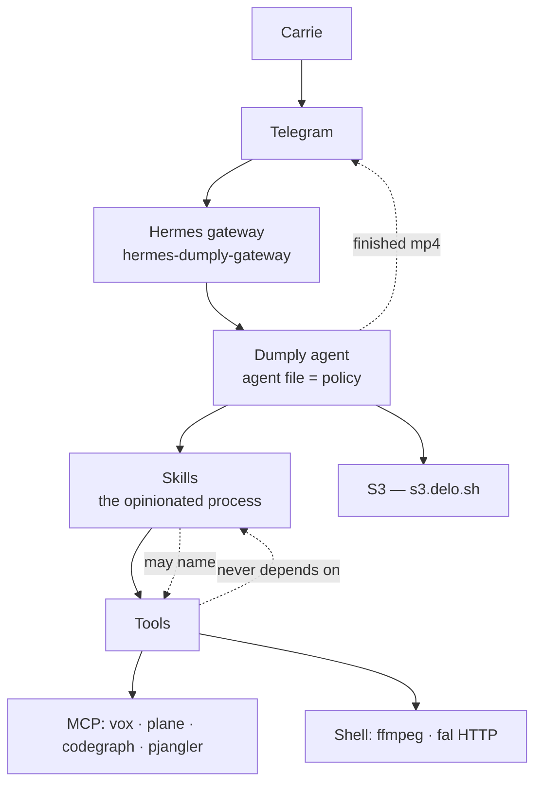
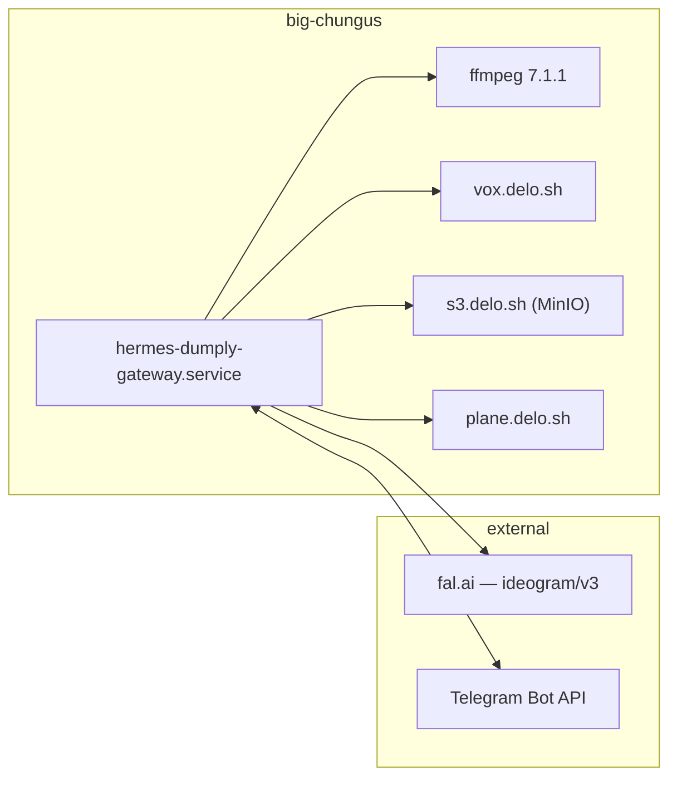

# Architecture Spine — TikTokTrivia

## Design Paradigm

**Agent-native, skill-driven.** There is no application tier. The deliverable is a Hermes agent — Dumply — carrying an agent file and a set of skills. Skills hold the opinionated process; the agent executes it with general-purpose tools it already has.

The work is done conversationally and ad hoc, because responsive iteration *is* the lesson: "you don't like it — what don't you like? we can change the stills, or try a model that does image-to-image." A fixed pipeline would obstruct exactly the behavior the curriculum is trying to produce.

| Layer | Is |
| --- | --- |
| Surface | Telegram → Hermes gateway → `dumply` profile |
| Policy | the agent file (`agent.system_prompt` in the profile delta) |
| Process | skills — one per durable procedure, including how to make the video |
| Tools | MCP servers and the shell, invoked directly |
| Artifacts | S3 |

## Invariants & Rules

### AD-1 — No application tier

- **Binds:** all
- **Prevents:** a future builder erecting a Python package, service, or pipeline between Carrie and the work — which makes mid-flight iteration harder, not easier, and moves the process out of the skills where the teaching lives.
- **Rule:** New capability is added as a skill, an MCP server, or a shell invocation. Standing process is written as a skill, never as application code. If something genuinely needs to be code, it is a script a skill calls — not a package with a lifecycle.

### AD-2 — One agent, one profile, on big-chungus

- **Binds:** CAP-8, CAP-10, CAP-11, CAP-14
- **Prevents:** a second profile or surface fragmenting the memory that CAP-8 requires be continuous across everything.
- **Rule:** Dumply is the `dumply` Hermes profile on big-chungus, memory bank `agent-dumply`. Nothing in making a video may require Carrie's own machine. Do not create a second profile for this project; extend this one.

### AD-3 — The scaffolding never surfaces

- **Binds:** CAP-8, CAP-12, and every lesson
- **Prevents:** Carrie being handed a workflow name, phase code, or command to operate, which converts a lesson into homework.
- **Rule:** BMAD runs inside the agent to keep the plan on rails and is never named to her. She is never required to run a command, edit a file, or open a second interface. Answering a technical question she asked is not a violation — deflecting one is.

### AD-4 — Stills come from fal, on Ideogram **v3**

- **Binds:** CAP-3
- **Prevents:** ten frames that don't look like one video; and the subtler trap of "upgrading" to the newer Ideogram and silently losing every consistency control.
- **Rule:** Generate through fal (`fal-ai/ideogram/v3`), holding style with `style_reference_images` + `style_codes` + a fixed `seed`. **Never Ideogram v4** — its endpoint accepts only `text_prompt`, `json_prompt`, `resolution`, `rendering_speed`, `enable_copyright_detection`; every style parameter was removed. A different model is swapped by editing the skill; nothing else may depend on which generator was used.

### AD-5 — Narration comes from vox, and its bytes are captured

- **Binds:** CAP-4
- **Prevents:** a render depending on a URL that has already expired.
- **Rule:** TTS is vox, already an MCP server on this profile. `/synthesize-url` links expire after 3600s and are delivery only — download the audio and write it to durable storage before any render references it.

### AD-6 — Video is assembled by ffmpeg directly

- **Binds:** CAP-4, CAP-5
- **Prevents:** a dependency that is dormant, broken against its own resolved pins, or simply invented.
- **Rule:** Invoke `ffmpeg` as a subprocess for both the skeleton cut and polish; polish lengthens the filtergraph and changes nothing else. **MoviePy and ffmpeg-python are excluded** — MoviePy's `TextClip` is broken against the Pillow version its own pin resolves to, which is exactly what captions would reach for, and ffmpeg-python has had no release in seven years despite topping search results.

### AD-7 — Artifacts live in S3, never in the repo

- **Binds:** CAP-1, CAP-3, CAP-4, CAP-5, CAP-6
- **Prevents:** binary bloat in a repo whose standing rule is that it holds source and never runtime droppings; and artifacts dying with a profile rebuild.
- **Rule:** Stills, narration and rendered video go to `s3.delo.sh`. The repo holds only the agent file, skills, and planning artifacts.

### AD-8 — Nothing reaches TikTok without Carrie

- **Binds:** CAP-6, CAP-7
- **Prevents:** the approval gate being optimized away once the process gets reliable.
- **Rule:** The finished video is delivered to Carrie over Telegram and waits. No code path publishes. Rejecting and redirecting an output is the behavior being taught, not an obstacle to route around.

### AD-9 — Never name what hasn't been verified

- **Binds:** all
- **Prevents:** the project's defining failure arriving early — a confident wrong name reaching someone who cannot tell it is wrong.
- **Rule:** No package, command, URL, model, or setting is stated to Carrie, or written into a skill, without being checked first. This binds amendments to this spine too: every external name in it was probed live, not recalled.



## Consistency Conventions

| Concern | Convention |
| --- | --- |
| Naming | One video = one run, `YYYY-MM-DD-<topic-slug>`. That slug is the S3 prefix and the name Carrie hears. |
| Artifacts | Every phase names the artifact it hands back before it starts. A phase describable only by its activity is not ready to run. |
| Secrets | `op://` references by item UUID, resolved at call time. Never a literal key in a skill, a config, or a message. |
| Models | Cheap models for retrieval (sourcing questions); strong models where judgment is the product (calibration, art direction). Routing everything to the frontier model is waste, not safety. |
| Lessons | One new concept per session, named only after the capability it bought has already done something she wanted. |

## Stack

| Name | Version |
| --- | --- |
| hermes-agent | 0.20.5 (release `0408fec7`) |
| ffmpeg | 7.1.1 (libass, libx264, libfreetype, libfontconfig) |
| Ideogram via fal | `fal-ai/ideogram/v3` |
| vox (VoxCPM2) | live at `vox.delo.sh` |
| MinIO | `s3.delo.sh` |

## Structural Seed

```text
TikTokTrivia/
  AGENTS.md                  # repo agent instructions (CLAUDE.md, GEMINI.md symlink here)
  .agents/skills/            # canonical skills; other CLI skill dirs symlink here
  _bmad-output/              # spec + planning artifacts
  docs/                      # curriculum material (CAP-16) — not yet created
```



## Capability → Architecture Map

| Capability | Lives in | Governed by |
| --- | --- | --- |
| CAP-1 question sourcing | video skill + web tooling | AD-1, AD-9, **open: no web backend** |
| CAP-2 creative direction | video skill | AD-1, conventions (models) |
| CAP-3 stills | video skill → fal | AD-4 |
| CAP-4 skeleton cut | video skill → vox + ffmpeg | AD-5, AD-6 |
| CAP-5 polish | video skill → ffmpeg | AD-6 |
| CAP-6 stage & approve | agent file + Telegram | AD-8 |
| CAP-7 declining instruction | skills accumulating | AD-1, CAP-13 |
| CAP-8 one remembering agent | `dumply` profile, bank `agent-dumply` | AD-2, AD-3 |
| CAP-9 provenance before install | agent file | AD-9 |
| CAP-10 session report | agent file | AD-3 |
| CAP-11 between-session invite | Hermes cron on this profile | AD-2 |
| CAP-12 one concept per phase | agent file + video skill | AD-3, conventions |
| CAP-13 skills by interview | new skills under `.agents/skills/` | AD-1 |
| CAP-14 notebook | S3 + agent memory | AD-7 |
| CAP-15 decomposition transfer | emergent; measured, not built | — |
| CAP-16 written curriculum | `docs/` | **deferred** |

## Deferred

- **Web search backend.** `web.backend`, `web.search_backend` and `web.extract_backend` are all empty on this profile. The first lesson's whole concept is that the agent has to go look. A `browser` block is configured and `x_search` points at `grok-4.20-reasoning`, so the capability may be reachable another way — but plain search is not wired. **Blocks Carrie's first session.**
- **Toolset scope.** Dumply inherited all 82 fleet skills including terminal, pjangler and plane MCP. Over-broad for this use. Revisit before she has unsupervised sessions.
- **The Plane board.** `.project.json` declares `TIKT` with an empty `board_id`. The board is a lesson prop, not a dependency — create it when the "this is how a board works" beat arrives.
- **`docs/` curriculum (CAP-16).** A phase-by-phase plan someone other than Jarad could run her through. Its own artifact; not this spine.
- **Cadence and dedupe.** Whether research runs weekly, whether one run yields one video or a backlog, and where "questions already used" is remembered. Decide once a second video exists — before then there is nothing to deduplicate against.
- **Fact-checking.** Nothing verifies that answers are correct. Revisit when a wrong answer actually ships, or before volume increases.
- **AI-disclosure.** Whether TikTok's AI-generated-content disclosure applies and whether it changes the render. Decide at the first real post.
