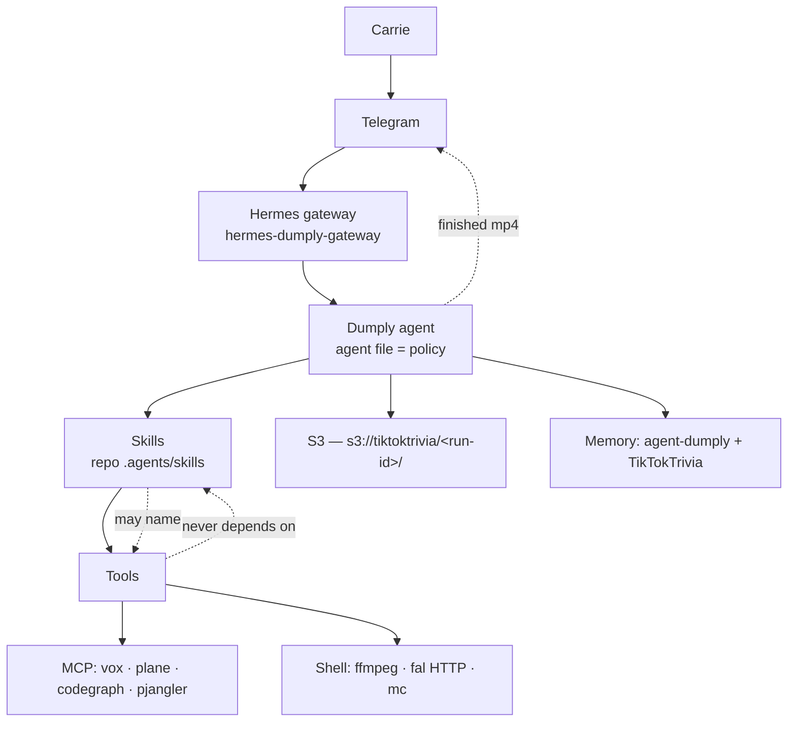
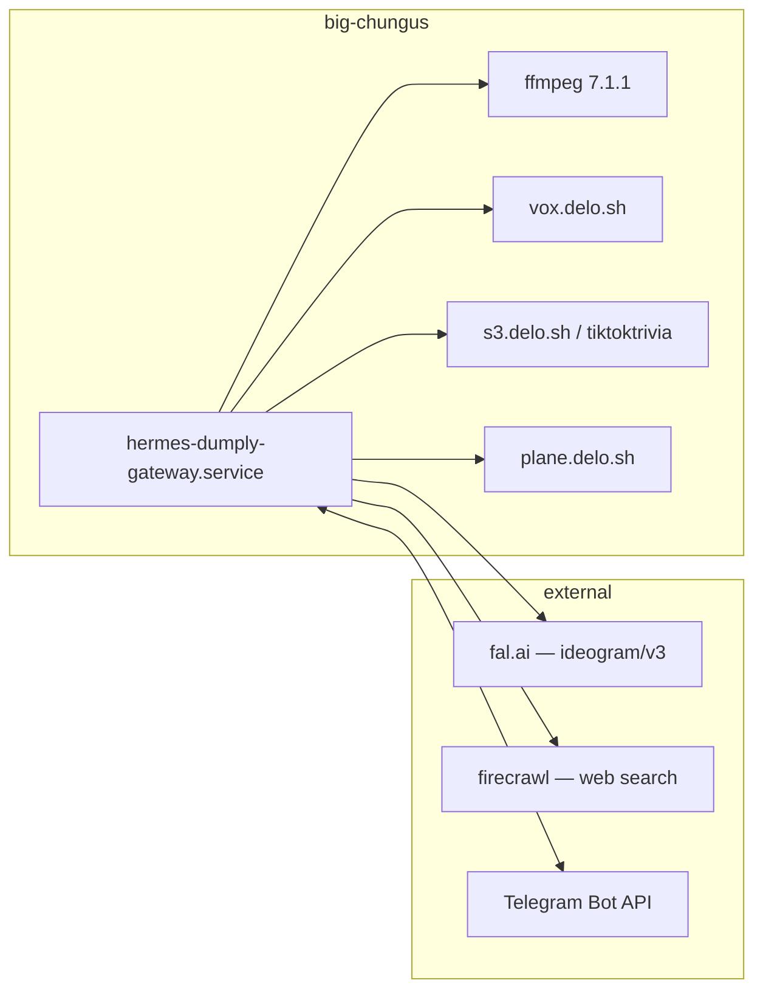

# Architecture Spine — TikTokTrivia

## Design Paradigm

**Agent-native, skill-driven.** There is no application tier. The deliverable is a Hermes agent — Dumply — carrying an agent file and a set of skills. Skills hold the opinionated process; the agent executes it with general-purpose tools it already has.

The work is done conversationally and ad hoc, because responsive iteration *is* the lesson: "you don't like it — what don't you like? we can change the stills, or try a model that does image-to-image." A fixed pipeline would obstruct exactly the behavior the curriculum is trying to produce.

| Layer | Is |
| --- | --- |
| Surface | Telegram → Hermes gateway → `dumply` profile |
| Policy | the agent file (`agent.system_prompt` in the profile delta) |
| Process | skills — one per durable procedure, including how to make the video |
| Tools | MCP servers and the shell, invoked directly |
| Artifacts | S3 |

## Invariants & Rules

### AD-1 — No application tier

- **Binds:** all
- **Prevents:** a future builder erecting a Python package, service, or pipeline between Carrie and the work — which makes mid-flight iteration harder, not easier, and moves the process out of the skills where the teaching lives.
- **Rule:** New capability is added as a skill, an MCP server, or a shell invocation. Standing process is written as a skill, never as application code. If something genuinely needs to be code, it is a script a skill calls — not a package with a lifecycle.

### AD-2 — One agent, two memory banks

- **Binds:** CAP-8, CAP-10, CAP-11, CAP-14
- **Prevents:** a second profile fragmenting the continuous memory CAP-8 requires; and project state being written into an identity bank whose own mission forbids it, where it cannot be found again.
- **Rule:** Dumply is the `dumply` profile on big-chungus. Memory splits by kind: who she is and how she likes to work → `agent-dumply`; project state — phase position, question history, what she decided and rejected → a per-repo `TikTokTrivia` bank. Create that bank before the first session. Nothing in making a video may require Carrie's own machine, and no second profile is created for this project.

### AD-3 — The scaffolding never surfaces

- **Binds:** CAP-8, CAP-12, and every lesson
- **Prevents:** Carrie being handed a workflow name, phase code, or command to operate, which converts a lesson into homework.
- **Rule:** BMAD runs inside the agent to keep the plan on rails and is never named to her. She is never *required* to run a command, edit a file, or open a second interface. When she asks a direct technical question, answer it plainly — deflecting is its own form of talking down.

### AD-4 — Stills come from fal, on Ideogram **v3**, called directly

- **Binds:** CAP-3
- **Prevents:** ten frames that don't look like one video; a silent "upgrade" to the newer Ideogram that drops every consistency control; and a request that is rejected or ignored because two mutually exclusive style anchors were sent together.
- **Rule:** Generate through `fal-ai/ideogram/v3`. Hold style by generating frame 1, then frames 2–10 with `image_urls: [<frame 1 url>]` plus a **fixed `seed`**. The anchors are exclusive — `{image_urls | style}` **XOR** `style_codes` — so send one kind or the other, never both, and record which a run used. Set `image_size` explicitly; the endpoint default is `square_hd`, not vertical. **Never Ideogram v4** — its endpoint accepts only `text_prompt`, `json_prompt`, `resolution`, `rendering_speed`, `enable_copyright_detection`; every style parameter was removed. **Never the agent's built-in image tool** — `image_gen.provider: fal` pins no model, so it defaults to `fal-ai/flux-2/klein/9b`, and the in-tree Ideogram entry exposes no `image_urls` at all, making style reference impossible through that path. For a recurring on-screen subject, escalate to `fal-ai/ideogram/character`, which accepts `image_urls`, `reference_image_urls` and `seed` together.

### AD-5 — Narration is synthesized once and kept

- **Binds:** CAP-4, CAP-5
- **Prevents:** a render depending on an expired URL; and — worse — a later polish pass re-synthesizing narration, which on a diffusion TTS yields a *different performance*, shifting every scene boundary and desynchronising captions on a cut that AD-6 says polish must otherwise leave alone.
- **Rule:** TTS is vox, already an MCP server on this profile. `/synthesize-url` links expire after 3600s and are delivery only. The exact narration bytes used in a render are written to the run's S3 prefix **before** the render, and every later render re-fetches those bytes. Narration is never re-synthesized for a run that already has a cut.

### AD-6 — Video is assembled by ffmpeg directly

- **Binds:** CAP-4, CAP-5
- **Prevents:** a dependency that is dormant, broken against its own resolved pins, or simply invented.
- **Rule:** Invoke `ffmpeg` as a subprocess for both the skeleton cut and polish; polish lengthens the filtergraph and changes nothing else. **MoviePy and ffmpeg-python are excluded** — MoviePy's `TextClip` is broken against the Pillow version its own pin resolves to, which is exactly what captions would reach for, and ffmpeg-python has had no release in seven years despite topping search results.

### AD-7 — Artifacts live at one address

- **Binds:** CAP-1, CAP-3, CAP-4, CAP-5, CAP-6
- **Prevents:** binary bloat in a repo whose standing rule is source-only; artifacts dying with a profile rebuild; and two steps that both "write to S3" landing in different buckets, so polish finds an mp4 with no stills and regenerates ten frames that no longer match what Carrie approved.
- **Rule:** One run owns one prefix: `s3://tiktoktrivia/<run-id>/` on `s3.delo.sh`, reached through the `mc` `delo` alias. Beneath it, `stills/qNN.png`, `narration/qNN.wav`, `cuts/<name>-NN.mp4`, and `RUN.md` recording what was decided. Create the bucket before the first run. The repo holds only the agent file, skills and planning artifacts.

### AD-8 — Nothing reaches TikTok without Carrie

- **Binds:** CAP-6, CAP-7
- **Prevents:** the approval gate being optimized away once the process gets reliable.
- **Rule:** The finished video is delivered to Carrie over Telegram and waits. No code path publishes. Rejecting and redirecting an output is the behavior being taught, not an obstacle to route around.

### AD-9 — Verify, then name — and say so when you can't

- **Binds:** all
- **Prevents:** the project's defining failure arriving early — a confident wrong name reaching someone who cannot tell it is wrong. A bare prohibition does not survive this: it has already been demonstrated on this project that an agent told only what it *may not* do produces the forbidden thing anyway when cornered, because nothing named the permitted move.
- **Rule:** Before stating any package, command, URL, model, or setting — to Carrie, or into a skill — check it with a tool. If it cannot be checked, say plainly that it is unverified and go find out. Never state it anyway, and never deflect the question instead. This binds amendments to this spine: every external name here was probed live, and two that were not survived into the first draft as errors.

### AD-10 — Skills live in the repo, and the repo is on the load path

- **Binds:** CAP-13, CAP-16, AD-1
- **Prevents:** the product — the skills — being invisible to the agent that needs them, or living only in runtime state that a profile rebuild destroys. Under AD-1 the skills *are* the deliverable, so an unloaded skills directory is a broken build, not a config nit.
- **Rule:** `TikTokTrivia/.agents/skills/` is canonical. Put its **absolute** path in `skills.external_dirs` and add the repo to `security.trusted_project_dirs` — today the entry is the relative, misspelled `./agents/skills`, which resolves against `HERMES_HOME` and silently loads nothing. A skill is not installed until it appears in Dumply's index. Skills authored with Carrie are written here and committed in the same session, never left in the profile's disposable `skills/` directory.



## Operational Envelope

| Concern | Rule |
| --- | --- |
| Long work | A render takes minutes. Run it in the background and tell her it started, what it's doing, and roughly how long. A silent stall is the spec's named impatience failure. |
| Failure | A failed run leaves its prefix in place and says which step failed. Never silently retry a paid generation; ask. |
| Retention | Run prefixes are kept. Nothing is pruned without Carrie being asked — an old run is the notebook (CAP-14). |
| Cost | Ten frames ≈ $0.30–0.90 depending on `rendering_speed`. vox and ffmpeg are free. Any single action expected to exceed **$5** is named and confirmed before it runs. |
| Observability | Every run writes `RUN.md` to its prefix — what was asked, what was chosen, what it cost. That is also where Jarad reads what happened without interrupting her. |

## Consistency Conventions

| Concern | Convention |
| --- | --- |
| Run identity | One video = one run, `YYYY-MM-DD-<topic-slug>`. That slug is the S3 prefix and the name Carrie hears. |
| Artifacts | Every phase names the artifact it hands back before it starts. A phase describable only by its activity is not ready to run. |
| Secrets | `op://` references by item UUID, resolved at call time. Never a literal key in a skill, a config, or a message. |
| Web search | Pin `web.search_backend` explicitly. Left empty it auto-detects by preference order against whichever fleet keys happen to be injected — it works, but it is a side effect rather than a decision. |
| Models | Cheap models for retrieval (sourcing questions); strong models where judgment is the product (calibration, art direction). Routing everything to the frontier model is waste, not safety. |
| Lessons | One new concept per session, named only after the capability it bought has already done something she wanted. |

## Stack

| Name | Version |
| --- | --- |
| hermes-agent | 0.20.1 (2026.8.13), release `0408fec7` |
| ffmpeg | 7.1.1 (libass, libx264, libfreetype, libfontconfig) |
| Ideogram via fal | `fal-ai/ideogram/v3` |
| vox (VoxCPM2) | live at `vox.delo.sh` |
| MinIO | `s3.delo.sh`, bucket `tiktoktrivia` |
| web search | firecrawl (resolved; pin it) |

## Structural Seed

```text
TikTokTrivia/
  AGENTS.md                  # repo agent instructions (CLAUDE.md, GEMINI.md symlink here)
  .agents/skills/            # canonical skills — must be on Dumply's load path (AD-10)
  _bmad-output/              # spec + planning artifacts
  docs/                      # curriculum material (CAP-16) — not yet created
```



## Capability → Architecture Map

| Capability | Lives in | Governed by |
| --- | --- | --- |
| CAP-1 question sourcing | video skill + web search | AD-9, **open: durable home for the set** |
| CAP-2 creative direction | video skill | AD-1, conventions (models) |
| CAP-3 stills | video skill → fal | AD-4 |
| CAP-4 skeleton cut | video skill → vox + ffmpeg | AD-5, AD-6 |
| CAP-5 polish | video skill → ffmpeg | AD-5, AD-6 |
| CAP-6 stage & approve | agent file + Telegram | AD-8 |
| CAP-7 declining instruction | skills accumulating | AD-1, AD-10 |
| CAP-8 one remembering agent | `dumply` profile; both banks | AD-2, AD-3 |
| CAP-9 provenance before install | agent file | AD-9 |
| CAP-10 session report | agent file; `TikTokTrivia` bank | AD-2, AD-3 |
| CAP-11 between-session invite | Hermes cron on this profile | AD-2 |
| CAP-12 one concept per phase | agent file + video skill | AD-3, conventions |
| CAP-13 skills by interview | `.agents/skills/`, committed same session | AD-10 |
| CAP-14 notebook | run prefixes + `TikTokTrivia` bank | AD-2, AD-7 |
| CAP-15 decomposition transfer | emergent; measured, not built | — |
| CAP-16 written curriculum | `docs/` | **deferred** |

## Deferred

- **Where the question set persists — blocks Phase 2.** CAP-1 requires it live outside the chat, and Phase 2's taught concept is specifically "a real spreadsheet she can open." No Sheets MCP is on this profile. Live candidates: a Google Sheets MCP (matches the lesson exactly, needs wiring), the Plane board (already wired, but a board is not a spreadsheet), or a CSV in the run prefix she gets a link to. Needs deciding before Phase 2 runs.
- **Toolset scope.** Dumply inherited all 82 fleet skills including terminal, pjangler and plane MCP. Over-broad for this use. Revisit before she has unsupervised sessions.
- **The Plane board.** `.project.json` declares `TIKT` with an empty `board_id`. The board is a lesson prop, not a dependency — create it when the "this is how a board works" beat arrives.
- **`docs/` curriculum (CAP-16).** A phase-by-phase plan someone other than Jarad could run her through. Its own artifact; not this spine.
- **Cadence and dedupe.** Whether research runs weekly, whether one run yields one video or a backlog, and where "questions already used" is remembered. Decide once a second video exists — before then there is nothing to deduplicate against.
- **Fact-checking.** Nothing verifies that answers are correct. Revisit when a wrong answer actually ships, or before volume increases.
- **AI-disclosure.** Whether TikTok's AI-generated-content disclosure applies and whether it changes the render. Decide at the first real post.
